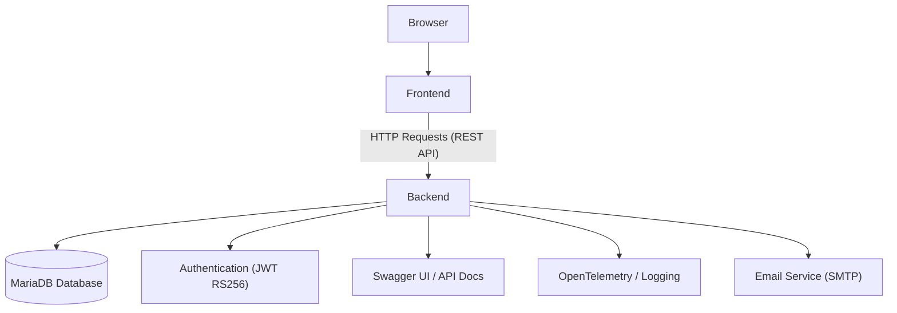

# ProdMate App

ProdMate App is a full-stack application designed to help users manage **Todos, Habits, Events, and User accounts**.  
It consists of two main components:

- **prodmate-backend** – A Node.js + Express + TypeScript API service with MariaDB (via Prisma ORM) for data persistence. It provides endpoints for managing data, authentication, and authorization, with integrated Swagger UI for API documentation and OpenTelemetry for observability.

- **prodmate-frontend** – A modern frontend client (React/Next.js + TypeScript) that interacts with the backend API to deliver a user-friendly interface.

---

## 📂 Project Structure

```
prodmate-app/
  ├── prodmate-backend/     # Backend service (API, database, authentication, etc.)
  └──  prodmate-frontend/   # Frontend client (UI, user interaction)
```

---

## 🚀 Tech Stack

### Backend
- Node.js / Express
- TypeScript
- Prisma ORM + MariaDB
- Swagger UI + swagger-jsdoc
- OpenTelemetry
- Nodemailer (SMTP)
- Helmet + CORS
- Morgan + Winston (logging)

### Frontend
- React / Next.js
- TypeScript
- TailwindCSS (or other styling framework)
- Axios / Fetch for API calls

---

## 📦 Installation

### Clone repository

```bash
git clone https://github.com/dhlananhh/prodmate-app
cd prodmate-app
```

### Install dependencies
You need to install dependencies separately for backend and frontend:

```bash
cd prodmate-backend
npm install

cd ..

cd prodmate-frontend
npm install
```

---

## 🛠️ Backend Overview

The backend (`prodmate-backend`) provides:

- RESTful API endpoints for **Users, Todos, Habits, Events**
- JWT-based authentication (RS256 with RSA keys)
- Role-based authorization
- Integrated Swagger UI for API documentation
- OpenTelemetry for monitoring and tracing
- Email sending via SMTP (password reset, notifications)

> 📌 Detailed backend setup instructions are available in the `prodmate-backend/README.md`.

---

## 🖥️ Frontend Overview

The frontend (`prodmate-frontend`) provides:

- A modern web interface built with React/Next.js
- TypeScript for type safety
- TailwindCSS (or other styling framework) for UI
- Integration with backend API via Axios/Fetch
- User authentication and session management
- Pages for managing Todos, Habits, Events, and User accounts

---

## 🗂️ System Architecture

The diagram below shows how the frontend communicates with the backend:



---

## 📝 Notes

- Backend and frontend are developed and maintained separately but work together as a unified application.  
- For backend setup, including RSA key requirements, environment configuration, and production instructions, refer to `prodmate-backend/README.md`.  
- For frontend setup and usage, refer to `prodmate-frontend/README.md`.  
- Consider Docker or PM2 for process management in deployment.  

---

## 👩🏻‍💻 Author

- ProdMate App – Developed and maintained by **Lan Anh**  
- Contact:

<div align="left">
  <a href="mailto:dhlananh2309@gmail.com" target="_blank">
    
  </a>
  <a href="https://github.com/dhlananhh" target="_blank">
    
  </a>
</div>

---
