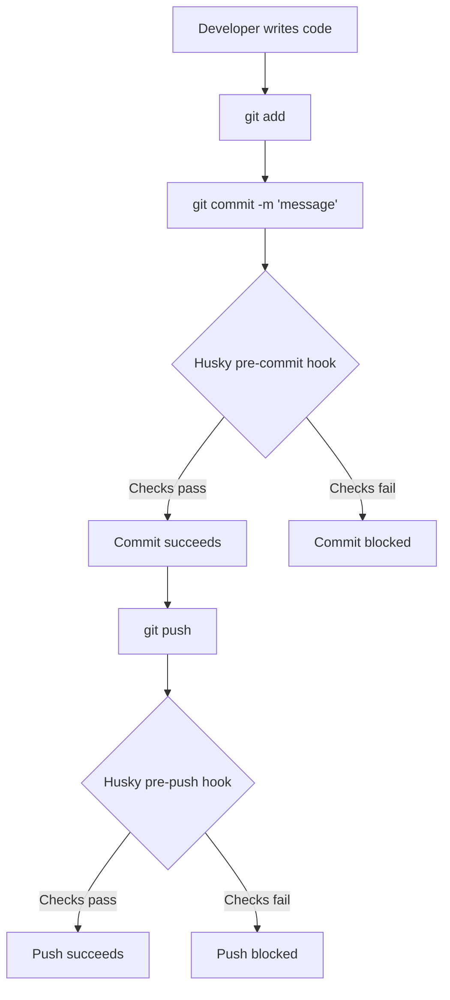
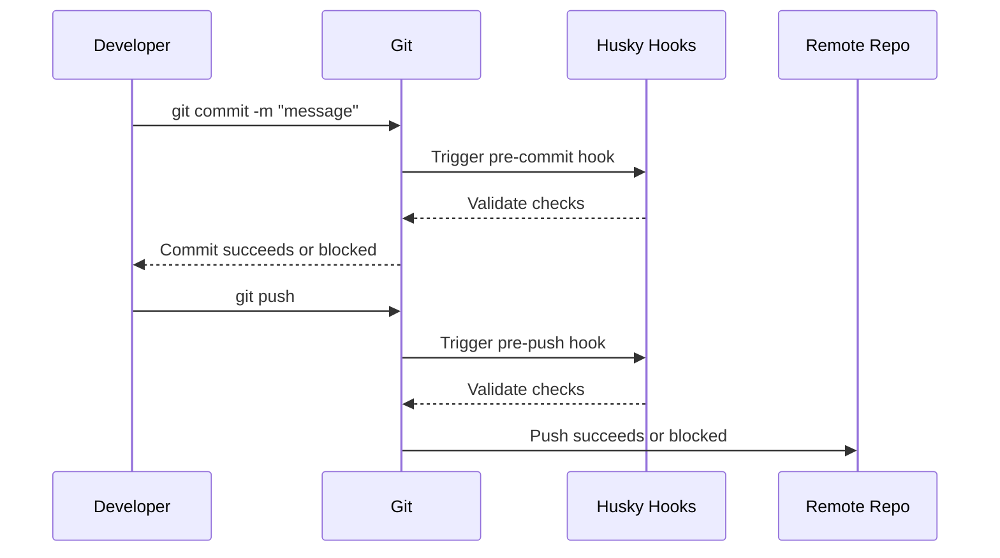
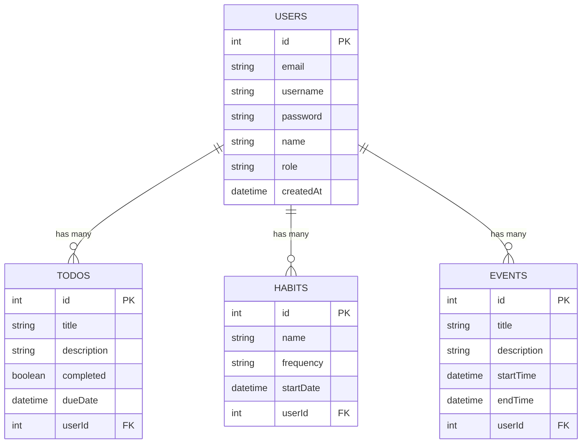

# ProdMate Backend

ProdMate API is a backend service built with **Node.js + Express + TypeScript**, using **MariaDB (via Prisma ORM)** for data persistence.  
It provides endpoints to manage **Users, Todos, Habits, and Events**, with integrated **Swagger UI** for API documentation and **OpenTelemetry** for observability.

---

## 🚀 Tech Stack
- **Node.js / Express** – Web framework
- **TypeScript** – Strongly typed language
- **Prisma ORM** – Database management
- **MariaDB** – Relational database
- **Helmet + CORS** – Security and cross-origin support
- **Morgan + Winston** – Logging
- **Swagger UI + swagger-jsdoc** – API documentation
- **OpenTelemetry** – Monitoring and tracing
- **Nodemailer** – Email sending via SMTP

---

## 📦 Installation

### Clone repository

```bash
git clone https://github.com/your-repo/prodmate-backend.git
cd prodmate-backend
```

### Install dependencies

```bash
npm install
```

---

## 🔧 Environment Setup

### Overview
The backend requires environment variables to run properly.  
A sample configuration file is provided as `.env.example`.

### How to use

1. **Copy the sample env file**:

  ```bash
  cp .env.example .env
  ```
  
  Or on Windows: 

  ```bash
  copy .env.example .env
  ```

2. **Edit the `.env` file** to match your local or production environment:
  - Update `DATABASE_URL` with your database connection string.
  - Set secure values for `JWT_SECRET` and `RESET_SECRET`.
  - Adjust `LOG_LEVEL` according to your needs (`info`, `debug`, `error`, etc.).
  - Configure `SMTP_HOST`, `SMTP_PORT`, and `EMAIL_FROM` for email services.
  - Provide paths for `PRIVATE_KEY_PATH` and `PUBLIC_KEY_PATH` if using RSA keys.

3. **Do not commit `.env`** to the remote repository, and never share your `.env` file publicly.  
  - `.env.example` is the template for groups or individuals.  
  - `.env` should remain local and private.

4. **Add `.env` to `.gitignore`**  
  - Open the `.gitignore` file in the project root.  
  - Ensure it contains the following line:
    ```
    .env
    ```
  - This prevents accidental commits of sensitive environment variables.

---

## 🛠️ Development

Run the server with auto reload:

```bash
npm run dev
```

---

## 🔨 Build & Run (Production)

⚠️ **Important**: Before building and starting the server, make sure you already have or have generated two RSA key files:

- `src/config/keys/private.pem` (private key)
- `src/config/keys/public.pem` (public key)

If you don’t know how to generate RSA keys, please refer to the detailed guide in [RSA.md](./docs/RSA.md)

Once the keys are in place, run:

```bash
npm run copy-keys
```

Then build and start the server:

```bash
npm run build
npm start
```

---

## 🐶 Husky Git Hooks

We use **Husky** to manage Git hooks and enforce consistent workflows across the repository. Husky ensures that important checks run automatically before commits and pushes, helping us maintain code quality and a clean Git history.

### How Husky works
- **Pre-commit hook**  
  Runs before a commit is finalized. It can be configured to check for issues such as merge conflict markers, large files, or formatting. If the checks fail, the commit will be blocked until the problems are resolved.

- **Commit-msg hook**  
  Runs after you type a commit message. It validates the message format (e.g., following Conventional Commits). If the message does not meet the rules, the commit will be rejected.

- **Pre-push hook**  
  Runs before pushing code to the remote repository. It can be configured to run additional checks, such as verifying branch naming conventions or preventing sensitive files from being pushed.

### Developer workflow
1. Stage your changes with `git add`.
2. Run `git commit -m "message"`.  
   - Husky triggers the **pre-commit** hook.  
   - If checks pass, the commit succeeds.  
   - If checks fail, fix the issues and retry.
3. Push your branch with `git push`.  
   - Husky triggers the **pre-push** hook (if configured).  
   - If checks pass, the push succeeds.  
   - If checks fail, fix the issues and retry.

### Visual Workflow



### Sequence Diagram



---

## 🔖 Useful Commands

- **Type-check project**:

```bash
npm run type-check
```

- **Cleanup logs**:

```bash
npm run cleanup:logs
```

- **Prisma migration**:

```bash
npx prisma migrate dev --name init
```

- **Prisma Studio (UI for DB management)**:

```bash
npx prisma studio
```

---

## 📌 API Endpoints

### Root
- `GET /` → API information

### Health
- `GET /api/health` → Server health check

### Users
- `POST /api/users/register` → Register new user  
- `POST /api/users/login` → Login user  
- `POST /api/users/refresh` → Refresh token  
- `POST /api/users/forgot-password` → Send reset email  
- `POST /api/users/reset-password` → Reset password  

### Todos
- `GET /api/todos` → Get all todos
- `POST /api/todos` → Create a new todo
- `GET /api/todos/{id}` → Get todo by ID
- `PUT /api/todos/{id}` → Update todo by ID
- `DELETE /api/todos/{id}` → Delete todo by ID

### Habits
- `GET /api/habits` → Get all habits
- `POST /api/habits` → Create a new habit
- `GET /api/habits/{id}` → Get habit by ID
- `PUT /api/habits/{id}` → Update habit by ID
- `DELETE /api/habits/{id}` → Delete habit by ID

### Events
- `GET /api/events` → Get all events
- `POST /api/events` → Create a new event
- `GET /api/events/{id}` → Get event by ID
- `PUT /api/events/{id}` → Update event by ID
- `DELETE /api/events/{id}` → Delete event by ID

### Metrics
- `GET /metrics` → Retrieve traces from OpenTelemetry logs  

---

## 📊 Entity–Relationship Diagram (ERD)

The diagram below illustrates the relationships between the main tables in the system:



---

## 📖 Swagger Documentation

Swagger UI is available at: `http://localhost:4000/api-docs`

Here you can explore all endpoints, schemas, and test API calls interactively.

--- 

## 🔑 RSA Key Management

To generate and manage RSA keys for JWT authentication, please refer to the detailed guide in: [RSA.md](./docs/RSA.md)

This document explains how to create a new RSA key pair using OpenSSL, security recommendations, and how to configure the keys in the project.

---

## 🔒 Authentication & Authorization

- JWT-based authentication (RS256 with RSA keys)
- Role-based authorization

---

## 📝 Notes

- Always run `npm run type-check` to ensure TypeScript type safety.
- For production, ensure RSA keys exist, then use command `npm run copy-keys && npm run build && npm start`.
- Consider Docker or PM2 for process management in deployment.

---

## 👩🏻‍💻 Author
- ProdMate Backend – Developed and maintained by **Lan Anh**

- Contact: 

<div align="left">
  <a href="mailto:dhlananh2309@gmail.com" target="_blank">
    
  </a>
  <a href="https://github.com/dhlananhh" target="_blank">
    
  </a>
</div>

---
