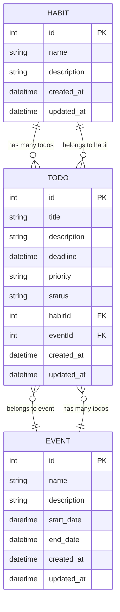

# Entity Relationship Diagram (ERD)

This document describes the entity relationship diagram for the Todo API system.  
The system consists of three main entities: **Todo**, **Habit**, and **Event**.

---

## Entities

### Todo
- **id** (integer, primary key)
- **title** (string, required)
- **description** (string, optional)
- **deadline** (datetime, optional)
- **priority** (enum: low, medium, high, required)
- **status** (enum: pending, in-progress, completed, required)
- **habitId** (integer, foreign key, nullable)
- **eventId** (integer, foreign key, nullable)
- **created_at** (datetime)
- **updated_at** (datetime)

### Habit
- **id** (integer, primary key)
- **name** (string, required)
- **description** (string, optional)
- **created_at** (datetime)
- **updated_at** (datetime)

### Event
- **id** (integer, primary key)
- **name** (string, required)
- **description** (string, optional)
- **start_date** (datetime)
- **end_date** (datetime)
- **created_at** (datetime)
- **updated_at** (datetime)

---

## Relationships
- A **Habit** can have many **Todos**.
- An **Event** can have many **Todos**.
- A **Todo** belongs to either:
  - A single **Habit** (via `habitId`), or
  - A single **Event** (via `eventId`), or
  - Standalone (no relation).

---

## Mermaid ERD Diagram

