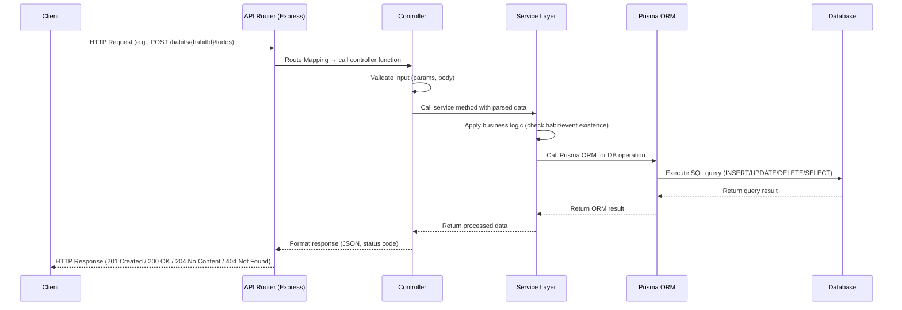

# System Design - Request Flow

This document describes the system design and request flow for the Todo API.  
The flow illustrates how a client request is processed through the API layer, controller, service, and database.

---

## Flow Description

1. **Client**
   - The client (e.g., frontend app, Postman, or another service) sends an HTTP request to the API.
   - Example: `POST /habits/{habitId}/todos`.

2. **API Layer (Express Router)**
   - The request is received by the Express router.
   - The router maps the endpoint to the appropriate controller function.
   - Example: `router.post("/habits/:habitId/todos", createTodoForHabit)`.

3. **Controller**
   - The controller handles request validation and parsing.
   - Extracts parameters (`habitId`, `todoId`) and body data (`title`, `description`, etc.).
   - Calls the corresponding service function.
   - Example: `createTodoForHabit(habitId, todoData)`.

4. **Service**
   - The service contains business logic.
   - Validates relationships (e.g., check if habit exists).
   - Calls the database layer (Prisma ORM) to perform CRUD operations.
   - Example: `prisma.todo.create({ data: { ... } })`.

5. **Database**
   - The database stores and retrieves persistent data.
   - Tables: `Todo`, `Habit`, `Event`.
   - Relationships: One Habit/Event can have many Todos.

6. **Response**
   - The service returns the result to the controller.
   - The controller formats the response and sends it back to the client.
   - Example: `201 Created` with the new Todo object.

---

## Mermaid Flowchart

```mermaid
flowchart LR
    A[Client] --> B["API Layer (Express Router)"]
    B --> C[Controller]
    C --> D[Service Layer]
    D --> E["Database (Prisma ORM)"]

    %% Response flow back
    E --> D
    D --> C
    C --> B
    B --> A

    %% Labels for clarity
    A:::client
    B:::api
    C:::controller
    D:::service
    E:::database

    
    classDef client fill:#f9f,stroke:#333,stroke-width:1px;
    classDef api fill:#bbf,stroke:#333,stroke-width:1px;
    classDef controller fill:#bfb,stroke:#333,stroke-width:1px;
    classDef service fill:#ffb,stroke:#333,stroke-width:1px;
    classDef database fill:#fbb,stroke:#333,stroke-width:1px;

    
    A ---|"HTTP Request"| B
    B ---|"Route Mapping"| C
    C ---|"Validation & Parsing"| D
    D ---|"Business Logic"| E
    E ---|"CRUD Operations"| D
    D ---|"Result"| C
    C ---|"Format Response"| B
    B ---|"HTTP Response"| A
```

---

## Mermaid Sequence Diagram

